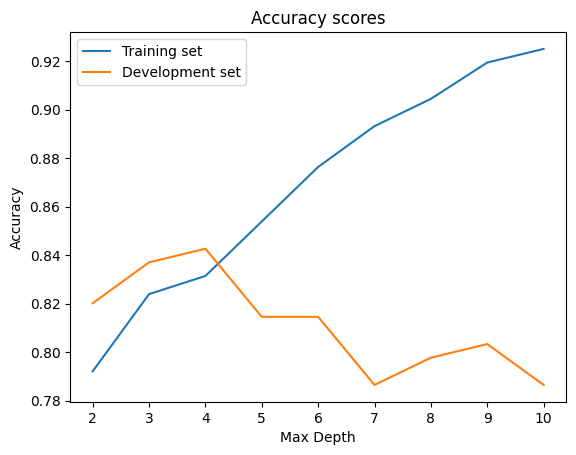

# Supervised Learning

HyperionDev - Data Science Skills Bootcamp (Task 20)

### Decision Trees and Random Forests

The goals of this task were: 
* Data preprocessing (including handling missing values, and one-hot encoding for categorical data). 
* Create a *Decision Tree* that can predict the survival of passengers on the Titanic, and measure its accuracy.
* Create a *Bagged*, *Random Forest*, and *Boosted Tree*, and measure their accuracy.
* From the random forest model, determine which is the most important feature predicting whether a passenger would survive or not.

### Data Source

The dataset provided for this task contains a list of passengers on the Titanic. 

## Data preprocessing

**Missing values** for Age and Port of Embarkation will be filled.  

*Note: Since this is not the goal of this task, I have reused the code I wrote for another task ([Handling Missing Data](https://github.com/vglarde/codingTasks/tree/master/Handling_Missing_Data)), allowing to fill the missing Age values based on the age group ratio for each passenger class.*

**Categorical values** (Gender and Port of Embarkation) will be one-hot encoded.

## Select and split the data

The following variables will be assigned to "x": 
* Pclass = Passenger Class
* Sex_male, Sex_female
* Age
* Sibsp = Travelling with siblings and/or spouse
* Parch = Travelling with parent(s) or children
* Fare
* Embarked_C, _Q, _S = Port of embarkation (respectively Cherbourg, Queenstown, Southampton)

Data will be split between Training (_train), Development (_dev), and Test (_test) sets. 
* Data will initially be split between Training (80%) and Test (20%) sets. 
* Then the Training data will be further split between Training (75%) and Development (25%) sets. 

## Decision Tree

After training a Decision Tree without *max_depth* restriction, I have iterated and plotted the *max_depth* accuracy scores for the Training and Development sets in order to identify the ideal decision tree *max_depth*, which appear to be around 4, as shown below.

The final model shows an 83% accuracy for the Test set, which is well whithin acceptable accuracy levels.

The close results for the accuracy of the Test set (83%) and the Training set (84%) also show that the final model does not seem to be affected by overfitting.

## Random Forests

Following the task instructions, I started by creating a *Bagged*, *Random Forest*, and *Boosted Tree*.

I used the optimal *max_depth* of 4 defined earlier in the task, fit the data, and extracted the accuracy score for this three ensemble learning methodes. 

After extracting the importance score from the Random Forest, I dropped the "Port of Embarkation" variables, having little to no influence on the accuracy, but reducing the training time. 

The next step was to find the best *n_estimators* value. After further refinement, it tuned the *n_estimators* value at 100 decision trees (best compromise between accuracy score, and memory ressources).

The last step was to generate accuracy scores for each model with the following settings, then compare their performances:
* max_depth = 4
* n_estimators = 100

### Accuracy scores

The best performing model is Bagging, with an accuracy score of 81.56%.

The Base model and Random Forest have the same accuracy score of 80.45%.

The Boosted Tree model is the worst-performing one, with 79.89% (even lower than the Base model).
